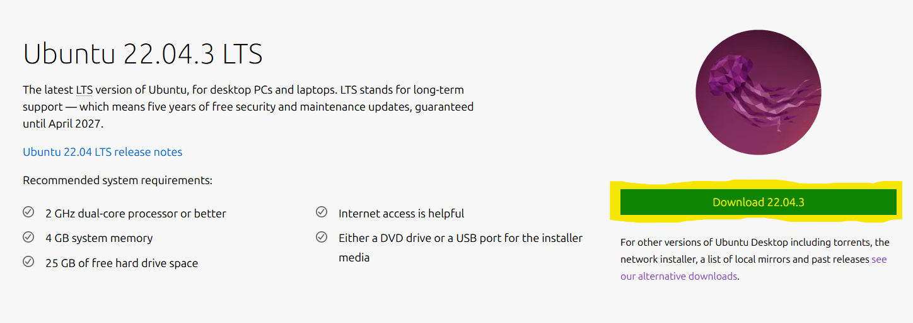

# Virtual Machine Setup Guide
### This guide takes you through the required steps to install your own virtual instance of Ubuntu.

## Step 1: 
### Navigate to the Ubuntu download page, and download the latest version.
https://ubuntu.com/download/desktop

#### Download the latest LTS Ubuntu version.

#### It should appear in your downloads folder.

