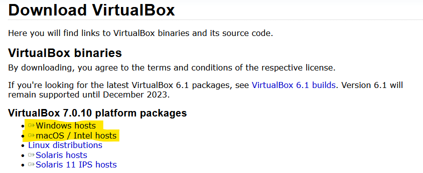
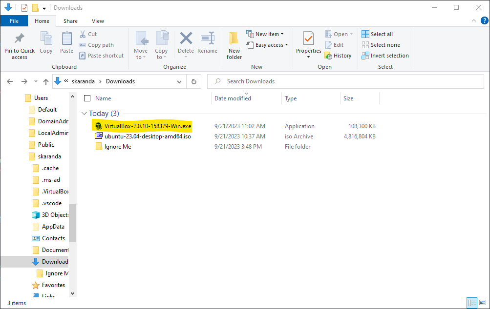
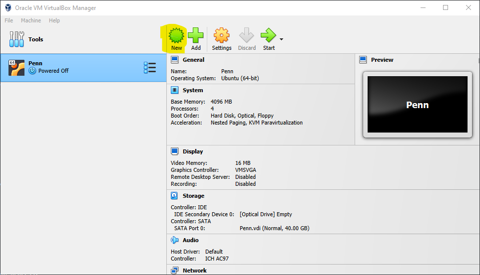
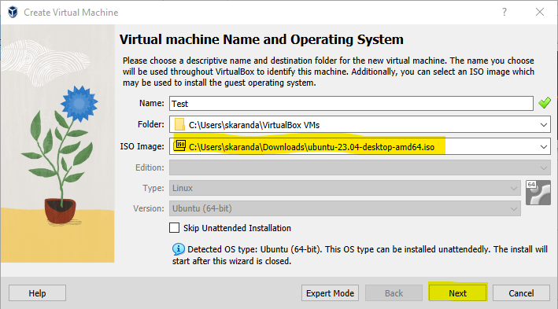
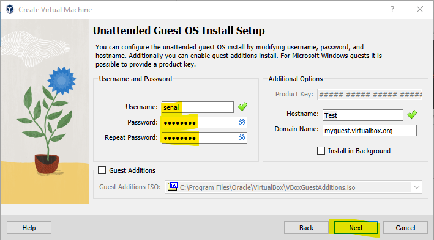
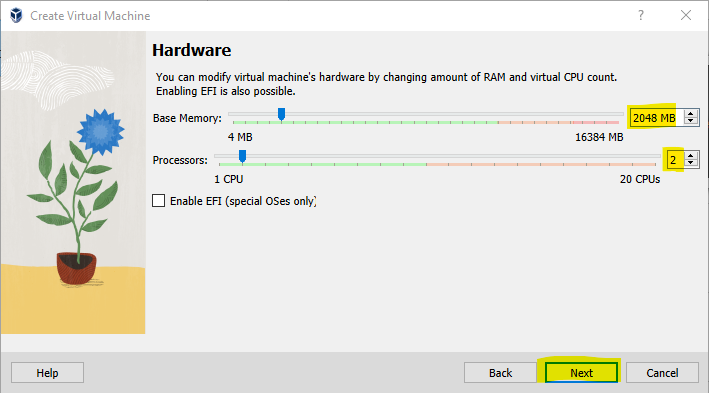
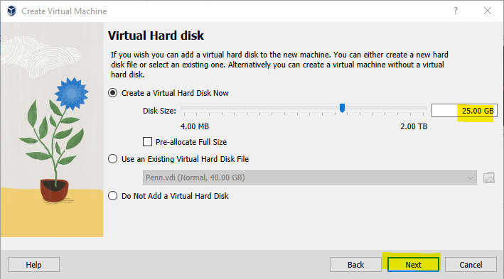
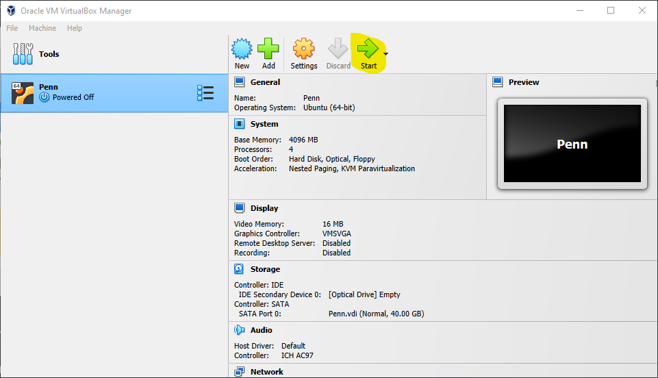

# Virtual Machine Setup Guide
### This guide takes you through the required steps to install your own virtual instance of Ubuntu.

## Step 1: Download Ubuntu
### Navigate to the Ubuntu download page, and download the latest version.
https://ubuntu.com/download/desktop

#### Download the latest LTS Ubuntu version.

#### It should appear in your downloads folder.

## Step 2: Install VirtualBox
### Navigate to the Virtualbox download page, and download the latest version.
https://www.virtualbox.org/wiki/Downloads

#### Download the latest VirtualBox version.

#### It should appear in your downloads folder.

### Run the installer and go through the whole installation process.

## Step 3: Setup VM in VirtualBox
### Open VirtualBox and proceed below.

### Press the 'New' button.

### Fill out the name and set a folder if you want.
### Select the image by pressing: The dropdown > 'Other' > Navigate to your VM file in your 'Downloads' folder.

### Set your username and password, you can leave the rest alone.

### Set 'Base Memory' to at least 2048MB (2GB) and Processors to at least 2.

### Set the 'Disk Size' to at least 25GB.

### Press 'Finish' and wait for your VM to be set up!

## Step 5: Run VM and Login
### On the main screen in VirtualBox, select your new VM and press 'Start'.
#### Log in once it's booted, and you're ready to go!

